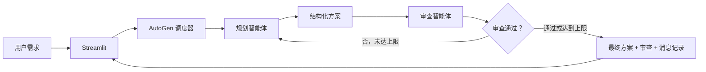

# AutoGen Azure Architecture Designer

一个完全本地运行的 Azure 架构设计 Web 应用。Microsoft AutoGen 负责组织规划智能体和审查智能体协作，Phi-3 Mini GGUF 通过 `llama-cpp-python` 在本机推理，Streamlit 展示消息过程和最终方案。

本项目只生成架构建议，不连接 Azure 订阅、不调用 Azure 管理 API、不创建真实资源，也不需要 Azure 或云端模型凭证。

## 功能

- 规划智能体将自然语言需求转换为结构化 Azure 资源清单。
- 审查智能体检查单点故障、可用区/区域冗余、数据持久性、备份、故障转移和监控。
- 调度器显式传递已校验的方案与审查 JSON，完成有限轮次的“规划—审查—修订—再审”闭环。
- 输出使用 Pydantic 校验，错误格式只进行有限纠正，不导致无限对话。
- Streamlit 按智能体步骤更新进度，展示资源表、架构策略、审查问题和全部角色消息。
- 可选将完整运行写入本地 JSONL，默认不纳入 Git。

## 协作流程



更详细的模块与状态设计见 [`docs/architecture.md`](docs/architecture.md)。

## 环境要求

当前验证环境：

- macOS Apple Silicon
- Python 3.11.15
- Phi-3 Mini 4K Instruct Q4 GGUF
- AutoGen AgentChat/Core 0.7.5
- `llama-cpp-python` 0.3.34
- Streamlit 1.48.1

建议预留至少 5 GiB 磁盘空间和 6 GiB 可用内存。模型文件约 2.2 GiB，不包含在仓库中。

## 安装

```bash
python3.11 -m venv .venv
source .venv/bin/activate
python -m pip install --upgrade pip
```

Apple Silicon 建议先从源码编译带 Metal 支持的 `llama-cpp-python`：

```bash
CMAKE_ARGS="-DCMAKE_OSX_ARCHITECTURES=arm64 -DCMAKE_APPLE_SILICON_PROCESSOR=arm64 -DGGML_METAL=on" \
python -m pip install --no-binary=llama-cpp-python llama-cpp-python==0.3.34

python -m pip install -r requirements.txt
```

如默认 PyPI 在当前网络不可达，可在上述 `pip install` 命令中临时增加可信的 `--index-url`；仓库不强制绑定镜像。

## 准备 Phi-3 模型

可使用 Hugging Face CLI 下载 Microsoft 的 GGUF 文件：

```bash
python -m pip install huggingface_hub
hf download microsoft/Phi-3-mini-4k-instruct-gguf \
  Phi-3-mini-4k-instruct-q4.gguf \
  --local-dir models
```

然后配置绝对路径：

```bash
export PHI3_MODEL_PATH="/absolute/path/to/Phi-3-mini-4k-instruct-q4.gguf"
export PHI3_MODEL_ROOT="/absolute/path/to"
```

也可在 Streamlit 侧边栏输入 `PHI3_MODEL_ROOT` 目录内的绝对路径。模型必须是
该目录内非符号链接的常规 `.gguf` 文件，并包含有效 GGUF 文件头。不要将 GGUF 加入 Git。

## 运行 Web 应用

```bash
source .venv/bin/activate
streamlit run app.py
```

浏览器打开 Streamlit 显示的本地地址。在侧边栏确认模型路径、审查轮次和 Metal/CPU，输入需求后点击“生成并审查方案”。

达到最大轮次不等于审查通过：界面会保留最新方案，并显示仍未解决的审查项。

## 最小验证

不加载模型的配置检查：

```bash
python scripts/smoke_test.py --check-config
python scripts/orchestrator_smoke_test.py
python -m compileall -q app.py src scripts
```

真实本地模型验证：

```bash
python scripts/smoke_test.py
python scripts/agent_smoke_test.py
python scripts/orchestrator_smoke_test.py --real
```

CPU 回退：

```bash
PHI3_N_GPU_LAYERS=0 python scripts/smoke_test.py
```

## 目录结构

```text
.
├── app.py                         Streamlit 入口
├── requirements.txt              直接依赖版本
├── src/
│   ├── config.py                  本地模型与轮次配置
│   ├── local_model_client.py      AutoGen ↔ llama.cpp 适配
│   ├── schemas.py                 Pydantic 数据契约
│   ├── prompts.py                 规划/审查/修订提示词
│   ├── output_parser.py           JSON 候选提取与校验
│   ├── agents.py                  两个独立 AutoGen 角色
│   ├── orchestrator.py            多轮协作、事件与终止
│   ├── trace_writer.py            本地 JSONL 记录
│   └── ui.py                      Streamlit 渲染函数
├── scripts/                       最小冒烟与协议验证
├── examples/                      可复用需求示例
├── docs/                          需求、架构和工作日志
├── results/                       本地运行记录（默认忽略）
└── tests/                         下一版本的完整测试位置
```

## 结构化容错边界

为适配 Phi-3 Mini，程序只做可解释、确定性的处理：

- 忽略单个完整 JSON 前后的简短说明或外层代码围栏。
- 如响应中只有一个 JSON 候选通过目标 Schema，选择该完整候选。
- 将策略字段的单字符串无损封装为单元素列表。
- 如审查已有 `findings[].recommendation` 却漏掉汇总列表，原样复制现有建议。

程序不猜测 Azure 资源、不修改建议内容、不在多个合法 JSON 方案中自行选择。

## 已知限制

- Phi-3 Mini Q4 是小型量化模型，Azure SKU、区域名称和架构建议可能不准确，结果必须由专业人员审核。
- 4K 上下文限制了需求长度、资源数和审查详细程度。
- “审查智能体通过”只是模型对文本方案的判断，不是 Azure Well-Architected 正式认证。
- 当前版本提供必要冒烟验证；完整单元/集成测试、性能评测和最终 ZIP 验收属于下一版本。

## 安全和数据边界

- 无 Azure SDK 资源操作和云端模型客户端。
- 需求、模型输出和 trace 仅在本机进程与文件系统中流转。
- `.env`、GGUF、虚拟环境、运行日志和 ZIP 已纳入 `.gitignore`。
- 界面只展示角色消息和结构化产物，不请求隐藏思维链。
