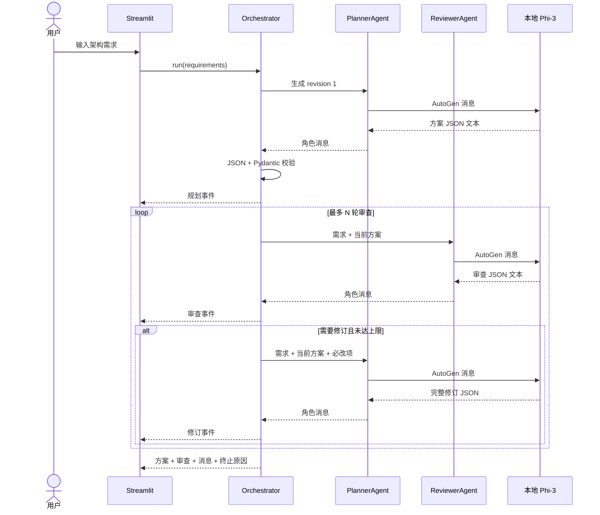

# 系统架构

## 组件边界

| 组件 | 职责 | 不负责 |
|---|---|---|
| Streamlit | 需求输入、本地配置、事件展示、结果展示 | 不直接组织智能体对话 |
| Orchestrator | 传递验证上下文、控制轮次、判断终止、发布事件 | 不猜测 Azure 配置或修改审查语义 |
| PlannerAgent | 生成初始方案和完整修订方案 | 不自行宣布审查通过 |
| ReviewerAgent | 检查高可用性并返回决策和必改项 | 不部署资源，不直接重写方案 |
| Local model client | 将 AutoGen 消息渲染为 Phi-3 instruct 协议并本地推理 | 不提供云端降级路径 |
| Parser/Schemas | 提取完整 JSON 候选并验证结构 | 不创造 Azure 资源或改写建议 |
| Trace writer | 可选追加本地 JSONL 记录 | 不上传、不覆盖旧记录 |

## 运行序列



## 状态与终止

| 条件 | 运行状态 | 终止原因 | 返回内容 |
|---|---|---|---|
| 审查器返回 `approved` | `completed` | `approved` | 通过的最终方案与审查 |
| 审查仍未通过但达到上限 | `completed` | `max_review_rounds` | 最新验证方案与未解决项 |
| 模型、解析或配置错误 | `failed` | `error` | 已完成消息、可用的中间方案和错误摘要 |

格式错误最多纠正一次。纠正使用新的同角色 AutoGen 上下文，避免失败长输出挤占 Phi-3 4K 窗口。

## 本地数据流

```text
浏览器本地页面
  → Streamlit Python 进程
  → AutoGen AgentChat 对象
  → 进程内 llama-cpp-python
  → 本机 GGUF 文件
  → 进程内结构校验
  → Streamlit Session State
  → 可选本地 results/*.jsonl
```

源码中没有 Azure 凭证、Azure SDK 部署调用或云端 LLM 客户端。
